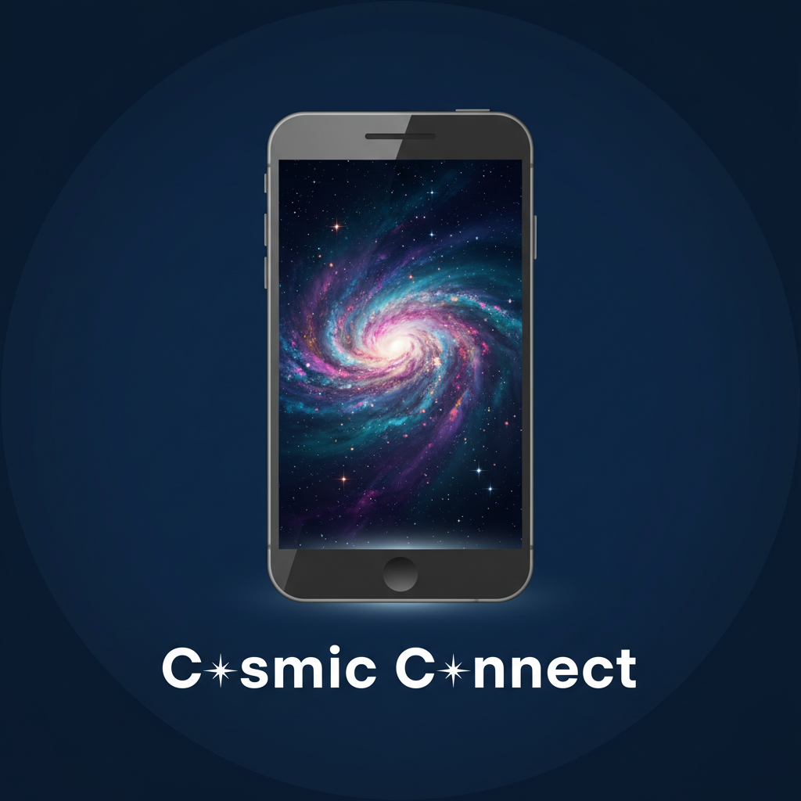

<div align="center">
  

  # COSMIC Connect Android

  **Seamless device communication between Android and COSMIC Desktop**

  [](https://github.com/olafkfreund/cosmic-connect-android)
  [](docs/protocol/)
  [](LICENSE)
  [](https://github.com/olafkfreund/cosmic-connect-core)

</div>

---

## Overview

COSMIC Connect enables Android devices to communicate with COSMIC Desktop computers, providing features like clipboard sharing, notification sync, file transfer, and remote control. Built with a **hybrid Rust + Kotlin architecture** for maximum reliability, security, and code reuse.

## Features

- **Shared Clipboard** - Copy and paste between phone and desktop
- **Notification Sync** - Read and reply to Android notifications from desktop
- **File & URL Sharing** - Transfer files and URLs between devices
- **Multimedia Remote Control** - Use phone as media player remote
- **Virtual Touchpad & Keyboard** - Control computer from phone
- **Battery Monitoring** - View phone battery status on desktop
- **Find My Phone** - Make phone ring to locate it
- **Run Commands** - Execute predefined commands remotely
- **Telephony Integration** - SMS and call notifications on desktop

All features work wirelessly over Wi-Fi or Bluetooth using **secure TLS encryption**.

## Architecture

### Hybrid Approach

The project uses a **Rust core + Kotlin UI** architecture for optimal performance and code sharing:

#### Rust Core ([cosmic-connect-core](https://github.com/olafkfreund/cosmic-connect-core))
- Protocol implementation (KDE Connect protocol v8)
- Network communication and device discovery
- TLS certificate management and encryption
- Plugin system with FFI interfaces
- Packet creation and serialization
- Cross-platform business logic

#### Kotlin/Android (this repository)
- Android UI and Activities
- Platform-specific integrations
- Service lifecycle management
- FFI wrapper layer with type safety
- Widget and notification providers

#### Benefits
- **70%+ code sharing** with COSMIC Desktop applet
- **Single source of truth** for protocol implementation
- **Memory safety** via Rust's ownership system
- **Fix bugs once**, both platforms benefit
- **Type-safe FFI** via uniffi-rs bindings

### Technology Stack

#### Rust Core
- **Rust**: 1.84+ with Android targets (aarch64, armv7, x86, x86_64)
- **tokio**: Async runtime for network operations
- **uniffi-rs**: 0.27+ for FFI bindings generation
- **rustls**: Modern TLS implementation
- **serde**: JSON serialization/deserialization
- **cargo-ndk**: 4.1+ for Android cross-compilation

#### Android
- **Kotlin**: Modern Android development
- **Android SDK**: 35 (targeting Android 15)
- **Minimum SDK**: 23 (Android 6.0)
- **Gradle**: 8.14.1 with Kotlin DSL
- **AGP**: 8.7.3
- **JNA**: Native library loading
- **AndroidX**: Jetpack libraries

## Project Status

**Current Phase**: Plugin Migration & FFI Integration - **85% Complete**

### Completed Milestones

#### Phase 0: Foundation (100% Complete)
- **Issue #44**: Project restructuring and build system
- **Issue #45**: NetworkPacket FFI implementation
- **Issue #46**: Discovery service FFI
- **Issue #47**: TLS/Certificate management FFI
- **Issue #48**: Core FFI validation
- **Issue #51**: cargo-ndk build integration (9.3 MB native libs)

#### Phase 1: Plugin FFI Migration (80% Complete)
- **Issue #50**: FFI validation test framework (10 comprehensive tests)
- **Issue #54**: Battery Plugin FFI migration
- **Issue #55**: Telephony Plugin FFI migration
- **Issue #56**: Share Plugin FFI migration
- **Issue #57**: Notifications Plugin FFI migration
- **Issue #58**: Clipboard Plugin FFI migration
- **Issue #59**: FindMyPhone Plugin FFI migration
- **Issue #60**: **RunCommand Plugin FFI migration** - **JUST COMPLETED**

#### Build System Fixes (100% Complete)
- **168 compilation errors** resolved
  - Fixed Java plugin compatibility with FFI packets
  - Removed 520+ lines of duplicate helper functions
  - Fixed UniFFI binding signature clashes
  - Converted Plugin API to Kotlin properties
  - Fixed all NetworkPacket import issues

### In Progress

- Issue #52: Android FFI wrapper layer enhancements
- Remaining plugin migrations (10 plugins)
- UI modernization with Jetpack Compose
- Desktop integration testing

### Build Status

```
Kotlin Compilation: 0 errors
Java Compilation: 0 errors
APK Build: SUCCESSFUL (24 MB)
Native Libraries: Built (9.3 MB across 4 ABIs)
FFI Tests: 9/9 passing
```

### Plugin Migration Progress

| Plugin | Status | FFI Wrapper | Kotlin Port | Tests |
|--------|--------|-------------|-------------|-------|
| Battery | Done | Done | Done | Done |
| Telephony | Done | Done | Done | Done |
| Share | Done | Done | Done | Done |
| Notifications | Done | Done | Done | Done |
| Clipboard | Done | Done | Done | Done |
| FindMyPhone | Done | Done | Done | Done |
| RunCommand | Done | Done | Done | Done |
| Ping | Done | Done | WIP | WIP |
| MPRIS | WIP | WIP | Todo | Todo |
| MousePad | WIP | WIP | Todo | Todo |
| SystemVolume | WIP | WIP | Todo | Todo |
| Presenter | WIP | WIP | Todo | Todo |
| Connectivity | WIP | WIP | Todo | Todo |
| RemoteKeyboard | WIP | WIP | Todo | Todo |
| Photo | WIP | WIP | Todo | Todo |
| SFTP | WIP | WIP | Todo | Todo |
| SMS | WIP | WIP | Todo | Todo |
| LockDevice | WIP | WIP | Todo | Todo |

**Progress**: 7/18 plugins migrated (39%)

## Installation

### For Users

**Coming Soon** - This modernized app will be available on:
- Google Play Store
- F-Droid
- GitHub Releases (direct APK downloads)

**Desktop Requirement**: Install [cosmic-connect-desktop-app](https://github.com/olafkfreund/cosmic-connect-desktop-app) on your COSMIC Desktop system.

### For Developers

#### Prerequisites

**Option 1: NixOS (Recommended)**
- NixOS with flakes enabled
- Automatic environment provisioning

**Option 2: Manual Setup**
- Android Studio Ladybug or later
- Rust 1.84+ with Android targets
- Android NDK 27.0.12077973
- cargo-ndk 4.1+
- JDK 17+

#### Quick Start (NixOS)

```bash
# Clone repositories
git clone https://github.com/olafkfreund/cosmic-connect-android
git clone https://github.com/olafkfreund/cosmic-connect-core

# Enter development environment
cd cosmic-connect-android
nix develop

# Build native libraries
./gradlew cargoBuild

# Build debug APK
./gradlew assembleDebug

# Output: build/outputs/apk/debug/cosmicconnect-android-debug-*.apk
```

#### Quick Start (Non-NixOS)

See [docs/guides/GETTING_STARTED.md](docs/guides/GETTING_STARTED.md) for detailed setup instructions.

## Documentation

All documentation is organized in the `docs/` directory:

### Quick Links
- [Documentation Index](docs/INDEX.md) - Complete documentation catalog
- [Getting Started](docs/guides/GETTING_STARTED.md) - Setup and first steps
- [Architecture](docs/architecture/ARCHITECTURE.md) - System design
- [Project Plan](docs/guides/PROJECT_PLAN.md) - Development roadmap

### Categories
- `docs/guides/` - Setup, development, and implementation guides
- `docs/architecture/` - System architecture and design documents
- `docs/protocol/` - KDE Connect protocol v8 implementation details
- `docs/issues/` - Completed issue summaries and progress reports
- `docs/legacy/` - Historical documentation (reference only)

### Recent Documentation
- [Issue #60 Completion Summary](docs/issue-60-completion-summary.md) - RunCommand plugin migration
- [Issue #59 Completion Summary](docs/issue-59-completion-summary.md) - FindMyPhone plugin migration
- [Issue #58 Completion Summary](docs/issue-58-completion-summary.md) - Clipboard plugin migration
- [FFI Validation Plan](docs/issue-50-ffi-validation.md) - Comprehensive FFI testing

## Development

### Building

```bash
# Build Rust core library for Android (all ABIs)
./gradlew cargoBuild

# Build debug APK
./gradlew assembleDebug

# Build release APK (signed)
./gradlew assembleRelease

# Run unit tests
./gradlew test

# Run FFI validation tests
./gradlew test --tests FFIValidationTest

# Run specific test
./gradlew test --tests FFIValidationTest.testRunCommandPlugin

# Clean build
./gradlew clean
```

### Project Structure

```
cosmic-connect-android/
├── src/                                    # Android source code
│   ├── org/cosmic/cosmicconnect/           # Legacy Java/Kotlin code
│   │   ├── Plugins/                        # Plugin implementations
│   │   │   ├── BatteryPlugin/              # Migrated to FFI
│   │   │   ├── RunCommandPlugin/           # Migrated to FFI + Kotlin
│   │   │   ├── FindMyPhonePlugin/          # Migrated to FFI + Kotlin
│   │   │   └── ...                         # Others in progress
│   │   ├── Device.kt                       # Device management
│   │   └── BackgroundService.kt            # Main service
│   ├── org/cosmic/cosmicconnect/Core/      # New FFI wrapper layer
│   │   ├── NetworkPacket.kt                # Immutable packet wrapper
│   │   ├── DeviceInfo.kt                   # Device info types
│   │   └── CosmicConnectCore.kt            # Core initialization
│   └── uniffi/cosmic_connect_core/         # Generated FFI bindings
├── tests/                                  # Test suite
│   └── org/cosmic/cosmicconnect/
│       └── FFIValidationTest.kt            # 9 comprehensive tests
├── build/rustJniLibs/                      # Built native libraries (9.3 MB)
│   ├── arm64-v8a/                          # 2.4 MB
│   ├── armeabi-v7a/                        # 2.3 MB
│   ├── x86/                                # 2.3 MB
│   └── x86_64/                             # 2.3 MB
├── docs/                                   # Documentation
├── flake.nix                               # NixOS development environment
├── CLAUDE.md                               # Claude Code AI assistant config
└── README.md                               # This file

cosmic-connect-core/                        # Rust core library (separate repo)
├── src/
│   ├── protocol/                           # NetworkPacket, protocol types
│   ├── network/                            # Discovery, connections
│   ├── crypto/                             # TLS, certificates
│   ├── plugins/                            # Plugin implementations
│   │   ├── battery.rs                      # FFI enabled
│   │   ├── runcommand.rs                   # FFI enabled
│   │   └── ...
│   └── ffi/                                # FFI interface (uniffi)
└── bindings/                               # Generated language bindings
```

### Code Organization

**Legacy Code** (Being Gradually Replaced):
- `src/org/cosmic/cosmicconnect/` (excluding `Core/`)
- Original Java/Kotlin KDE Connect Android implementation
- Still used for UI and Android-specific functionality
- Being migrated plugin by plugin

**New Code** (Active Development):
- `cosmic-connect-core/` - Rust protocol implementation
- `src/org/cosmic/cosmicconnect/Core/` - Kotlin FFI wrapper
- `src/uniffi/cosmic_connect_core/` - Generated bindings (auto-generated)
- `build/rustJniLibs/` - Compiled native libraries

### Development Workflow

1. **Make changes** to Rust core or Kotlin code
2. **Build native libs**: `./gradlew cargoBuild` (if Rust changed)
3. **Build APK**: `./gradlew assembleDebug`
4. **Run tests**: `./gradlew test`
5. **Install on device**: `./gradlew installDebug`

## Testing

The project includes comprehensive FFI validation tests:

```bash
# Run all tests with detailed output
./gradlew test --info

# Run specific test suite
./gradlew test --tests FFIValidationTest

# Run on physical device or emulator
./gradlew connectedAndroidTest

# Run on Waydroid (NixOS)
waydroid session start
./gradlew installDebug
# Open Waydroid and test manually
```

### Test Coverage

| Category | Tests | Status |
|----------|-------|--------|
| Native Library Loading | 1 | Pass |
| FFI Call Performance | 1 | Pass |
| NetworkPacket FFI | 1 | Pass |
| Battery Plugin FFI | 1 | Pass |
| Telephony Plugin FFI | 1 | Pass |
| Notifications Plugin FFI | 1 | Pass |
| Clipboard Plugin FFI | 1 | Pass |
| FindMyPhone Plugin FFI | 1 | Pass |
| RunCommand Plugin FFI | 1 | Pass |
| **Total** | **9** | **Pass** |

Each test validates:
- Packet creation correctness
- Field values and types
- Serialization/deserialization
- Packet uniqueness (ID generation)
- Performance benchmarks

## Contributing

Contributions are welcome! Please:

1. **Check documentation**: Review [docs/INDEX.md](docs/INDEX.md) for relevant guides
2. **Understand priorities**: See [docs/guides/PROJECT_PLAN.md](docs/guides/PROJECT_PLAN.md)
3. **Follow patterns**: Reference [docs/guides/IMPLEMENTATION_GUIDE.md](docs/guides/IMPLEMENTATION_GUIDE.md)
4. **Write tests**: Add FFI validation tests for new functionality
5. **Update docs**: Keep documentation current with code changes

### Development Standards

- **Code Style**: Follow Kotlin conventions, use ktlint
- **Commits**: Clear, descriptive commit messages
- **PRs**: Include tests and documentation updates
- **FFI Changes**: Update both Rust and Kotlin sides
- **Breaking Changes**: Discuss in issues first

## Credits

This project builds upon the excellent foundation of [KDE Connect](https://community.kde.org/KDEConnect):

**Original KDE Connect repositories**:
- Desktop: https://invent.kde.org/network/kdeconnect-kde
- Android: https://invent.kde.org/network/kdeconnect-android

We are grateful to the KDE team for:
- Creating the original KDE Connect application and protocol
- Years of development and refinement
- Building a robust, secure communication protocol
- Establishing the open-source foundation we build upon

COSMIC Connect modernizes the Android app and adapts it for COSMIC Desktop while maintaining **full protocol compatibility** (v8).

## Related Projects

- [cosmic-connect-core](https://github.com/olafkfreund/cosmic-connect-core) - Shared Rust core library
- [cosmic-connect-desktop-app](https://github.com/olafkfreund/cosmic-connect-desktop-app) - COSMIC Desktop app
- [COSMIC Desktop](https://github.com/pop-os/cosmic-epoch) - System76's COSMIC desktop environment
- [KDE Connect](https://community.kde.org/KDEConnect) - Original KDE Connect project

## License

This project inherits the **GPL-3.0** license from KDE Connect.

See [LICENSE](LICENSE) for full license text.

## Contact & Support

- **Issues**: [GitHub Issues](https://github.com/olafkfreund/cosmic-connect-android/issues)
- **Documentation**: [docs/INDEX.md](docs/INDEX.md)
- **COSMIC Desktop**: [System76 COSMIC](https://system76.com/cosmic)
- **KDE Connect**: [KDE Community](https://community.kde.org/KDEConnect)

---

<div align="center">

**Status**: Active Development - Phase 1 (Plugin Migration)

**Build**: 

**Last Updated**: 2026-01-16

**Made for COSMIC Desktop**

</div>
